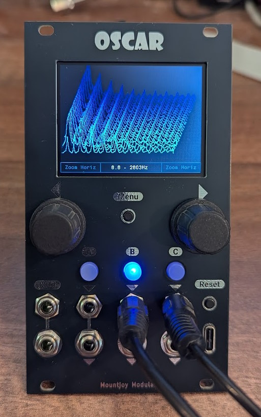

# Oscar Manual

## Table of Contents

- [Oscar Manual](#oscar-manual)
   * [Table of Contents](#table-of-contents)
   * [Introduction](#introduction)
   * [Basic Navigation](#basic-navigation)
   * [Oscilloscope](#oscilloscope)
   * [Tuner](#tuner)
   * [Spectrum Analyser](#spectrum-analyser)
   * [Waterfall Plot](#waterfall-plot)
   * [MIDI Analyser](#midi-analyser)
   * [Firmware Upgrade](#firmware-upgrade)

## Introduction

Oscar is a multi-function Eurorack module, combining oscilloscope, tuner, spectrum analyser, waterfall display and MIDI analyser.

It combines three channels each of which has an input selector button, input and buffered mult output. The MIDI analyser accepts a single serial MIDI input on 1/8" jack with unbuffered multiple. 

A USB socket allows analysis of USB MIDI data, firmware updates and a serial console with access to system configuration.

## Basic Navigation

A) Pressing the rotary encoders cycles through the different modes:

Oscilloscope -> Tuner -> Spectrum analyser -> Waterfall plot -> MIDI Analyser

Turning the encoders changes the parameters shown at the bottom left and right of the screen.

B) The rotary controllers also change the parameters shown on the bottom corners of the screen. Use the Menu button to choose which parameters are controllable on each encoder (these options vary according to mode).

C) The A, B and C buttons activate channels. In oscilloscope mode multiple channels may be selected. Otherwise a button just selects a single channel.

D) Inputs for channels A, B and C

E) Buffered multiples of the input channels

F) Serial MIDI input and unbuffered multiple (using the MIDI standard of Tip = Sink (Data), Ring = Source (5V) and Sleeve = Shield).

G) Reset button and USB C MIDI In

## Oscilloscope

The oscilloscope can display up to 3 channels, either in separate lanes or overlaid.

At the top right a frequency estimate is shown of the currently captured signal and at the bottom center the width of the display is shown in milliseconds.

A triggering system will align the display to the trigger point, shown by a yellow cross. If the signal has not crossed the trigger point after a second the screen will update and wait for the next trigger.

Pressing the Menu button allows different parameters to be assigned to the rotary encoders.

The following parameters can be assigned to the rotary encoders:

- **Horiz scale** Zooms the display horizontally from 0.7ms at the fastest time to 700ms at the slowest.

- **Vert scale** Zooms the display vertically from 1 volt to 12 volts peak to peak.

- **Multi-Lane** Selects whether multiple channels are overlaid or shown in separate lanes.

- **Trigger Y** Sets the vertical trigger position.

- **Trigger X** Sets the horizontal trigger position.

- **Trigger Ch** Selects which channel the trigger is active on (or no trigger to disable). Note that only a visible channel can be triggered on.

- **Calib Scale** Allows calibration of the vertical scale - feed in a signal of known amplitude and set so that the volt scale matches.

- **Calib Offset** Use to calibrate the zero volt position.

## Tuner

The tuner is used to tune audio rate signals. When a valid signal is received the tuner displays the musical note and the number of cents above or below concert pitch. Below is shown the Hertz measurement and an overlay of the captured signal.

A flashing dot at the top right of the screen changes each time a signal is captured and measured. The measurement time is shown in milliseconds at the bottom.

The rotary encoders provide the following options:

- **Vert scale** Zooms the wave overlay display vertically.

- **Tuner Mode** Two tuner modes are available. FFT is the most accurate but can be slightly slower. Zero Crossing mode checks for zero crossings in the signal which can be confused by complex waveforms, but is slightly faster in some cases.

- **Trace Overlay** Chooses whether the waveform is overlaid at the bottom of the screen.

## Spectrum Analyser

The Spectrum Analyser mode is used to display the harmonic content of a signal. The fundamental frequency is shown as a white bar whose height indicates the strength of the harmonic.

Additional harmonics are displayed as coloured bars, with the frequencies of the first five harmonics shown on the right of the display.

The captured waveform can be optionally overlaid on the screen and the frequency analysis range is displayed at the bottom.

Encoder parameters:

- **Vert scale** Zooms the wave overlay display vertically.

- **Auto Tune** The accuracy of an FFT analysis is affected by the sampling rate. The Auto tune mechanism used here attempts to adjust the sampling rate to an exact multiple of the signal for an accurate analysis. This can be disabled, usually to cope with very complex signals, but the accuracy of the frequency measurements will be adversely affected.

- **Horiz scale** If auto tune is disabled this alters the sampling rate to adjust the frequency of the spectrum being captured.

- **Trace overlay** Chooses whether the waveform is overlaid.

## Waterfall Plot

This mode displays the frequency spectrum of the signal as it changes over time. The only encoder action is to adjust the sampling frequency which affects which frequency ranges are displayed (shown at the bottom of the screen).

Note that altering the sampling frequency will change the time it takes to capture the samples to display so very low sampling rates will cause the screen refresh to fall.

## MIDI Analyser

Both serial and USB MIDI data can be displayed simultaneously. The display will show note/on off events, control changes, aftertouch and pitchbends. The MIDI clock rate is indicated by a flashing dot at the bottom right for serial MIDI and bottom left for USB. Sysex data is not shown.

Different colours are used to indicate the MIDI channel for each type of event displayed (also the number is shown in the far left column.

Serial MIDI input uses a 1/8" jack socket wired to the current MIDI standard, and is protected by an opto-coupler. The two serial sockets are wired as direct mults with no buffering.

USB MIDI is received on a USB-C socket. The module can only act as a USB device so is not suitable for analysing MIDI USB data from keyboards etc.

## Firmware Upgrade

A mechanism is provided to upgrade the firmware over USB. Note that the latest firmware for the module can be found here: [Oscar.elf](Oscar/Debug). Download the file (use raw format to get the file in binary format).

Connect a serial console application to the USB serial port:

In the serial console type **dfu**. This will reboot the module into DFU (Device Firmware Upgrade) mode.

Run the STM Cube Programmer software available here: [STM Cube Programmer](https://www.st.com/en/development-tools/stm32cubeprog.html).

1. Select USB connection
2. Click Refresh and select the appropriate USB port (USB1 here)
3. Click Connect

 
 

- Click 'Open file' and navigate to the Oscar_v3.elf firmware file downloaded from the [Github Repository](https://github.com/dchwebb/Oscar/tree/master/Oscar_v3/Debug).

 
 

- Click the 'Download' button to transfer the firmware onto Oscar.
- Restart the module. Note you can use the console command **info** to view the firmware build date to confirm an upgrade has succeeded.

