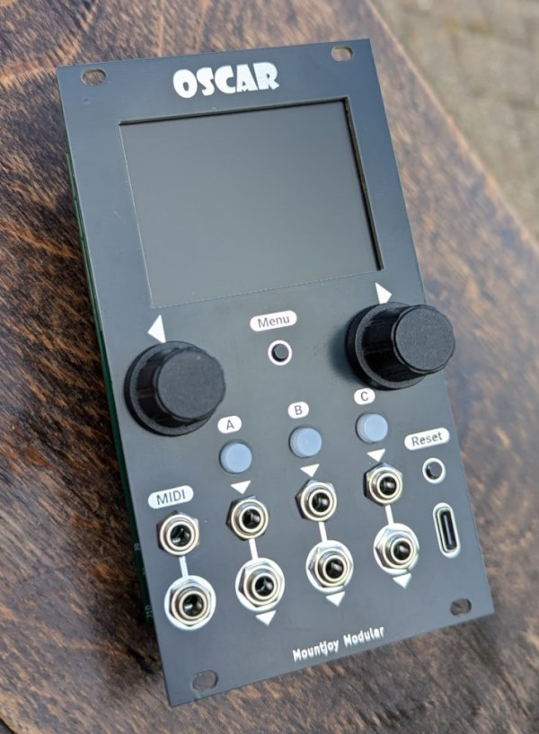
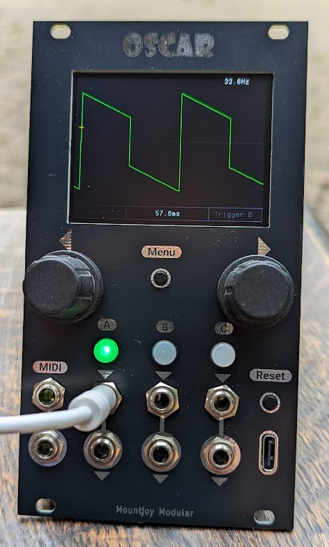
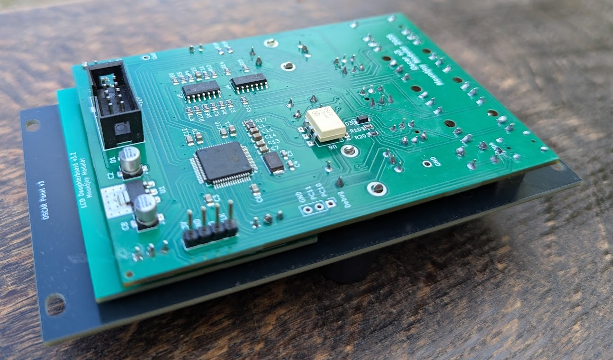
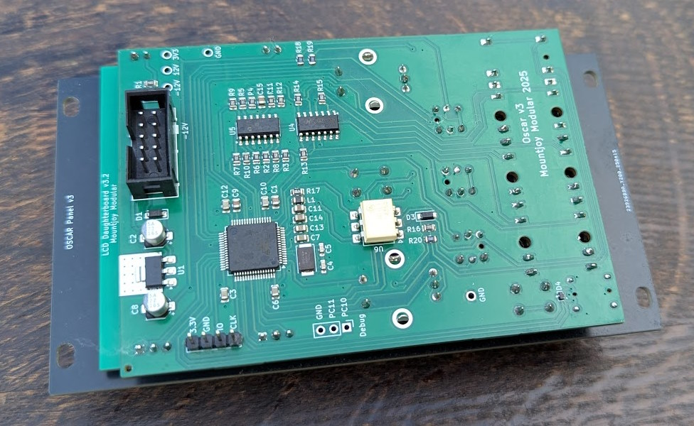

# Oscar

Overview
--------

Oscar is a three channel oscilloscope, tuner, spectrum analyser and MIDI event viewer designed for use in a Eurorack modular synthesiser.

- [Manual](Oscar_Manual.md)
- [Build Guide](Oscar_Build_Guide.md)
- [Bill of Materials](BOM.md)

Version 3 changes: 
- Optimised for DIY building
- Illuminated buttons for quick channel selection
- USB input for firmware updates and USB MIDI analysis
- An opto-coupler and passive mult on the serial MIDI input

Functional Overview
-------------------

The oscilloscope can display up to three channels at once, either in separate lanes or overlaid. Horizontal and vertical zoom are available and a trigger with adjustable x/y can be applied to any channel.

A tuner function allows for fast and accurate tuning:

The spectrum analyser is used to show the frequency components of any signal. The frequencies of the principal harmonics are shown both graphically and numerically. An autotune function dynamically adjusts the sample rate to lock on the fundamental frequency of the signal. This gives an extremely clear view of the frequency spectrum whilst being fast enough for real-time use.

A waterfall plot shows the frequency spectrum over time in a 3 dimensional view.

A MIDI event viewer displays the MIDI channel, note on/off status, pitchbends, control changes and aftertouch. Clock speed is indicated with a flashing dot. 

Technical
---------

Oscar uses an SMT32F446 microcontroller to capture incoming signals with the internal ADC and display the results on a 320x240 LCD display via SPI. Code is written in C++ 20 using the STM32CubeIDE Eclipse-based IDE. Hardware interfacing is carried out through custom code (ie no STM HAL libraries).

- [Schematics](Hardware_v3/Oscar_Components.pdf)

The microcontroller is clocked at 180MHz via an external 8MHz crystal oscillator. The analog inputs are scaled with an MCP6004 op-amp and the mult outputs buffered with a TL074 op-amp. The internal UART is used to capture serial MIDI data for display via a H11L1 optocoupler (to reduce the risk of ground hum).

The display is a 320x240 TFT LCD controlled with an ILI9341 driver. Screen refreshes are sent using SPI via DMA from the microcontroller. A USB C socket functions in USB 2.0 mode with an RCLAMP0502B providing ESD protection.

Analog signal capture is carried out via the internal 12 bit ADCs. Capture is controlled by a timer that is adjusted to the desired horizontal display frequency in oscilloscope mode. In Spectrum Analyser mode the autotune function dynamically alters the sampling rate to attempt to capture an integer multiple of the fundamental frequency of the incoming signal. This is done by inspecting the side-lobes of the FFT and altering the sampling rate to minimise the offset.

The tuner mode uses an overlapping FFT technique to increase accuracy. Using this mechanism samples 1 to 1024 are placed in one buffer and samples 512 to 1536 are placed in a second buffer. FFTs are carried out on each buffer and then the phase offset between the fundamental is measured. This can then be used to calculate the pitch with much enhanced accuracy for the additional processing time.

### Power Supply

The Eurorack +/-12V rails have reverse polarity protection and filtering. The 3.3V MCU and DAC digital power supplies are provided by an LT1117-3.3 linear regulator. A common digital/analog ground plane is used.

- +12V Current Draw: 151mA
- -12V Current Draw: 6mA

